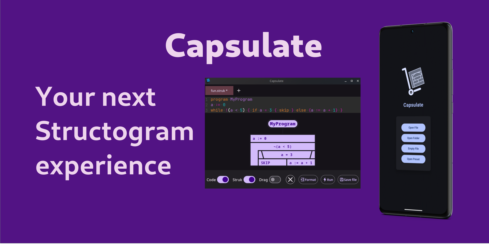

# Capsulate

A Compose Multiplatform project to create, edit and debug ELTE pseudocode blocks (structograms)

## State

### TODOs

- Drag & Drop 
  - solve scope issues
- Export via context menu option

### Ideas

- [LatexView with Katex and WebView()](https://github.com/judemanutd/KaTeXView)
- System colors, where totally unconventional
  - `kreadconfig6 --group Colors:Button --key ForegroundActive` plasma only way 
  - Might be an `xdg` solution for a more general approach on linux
